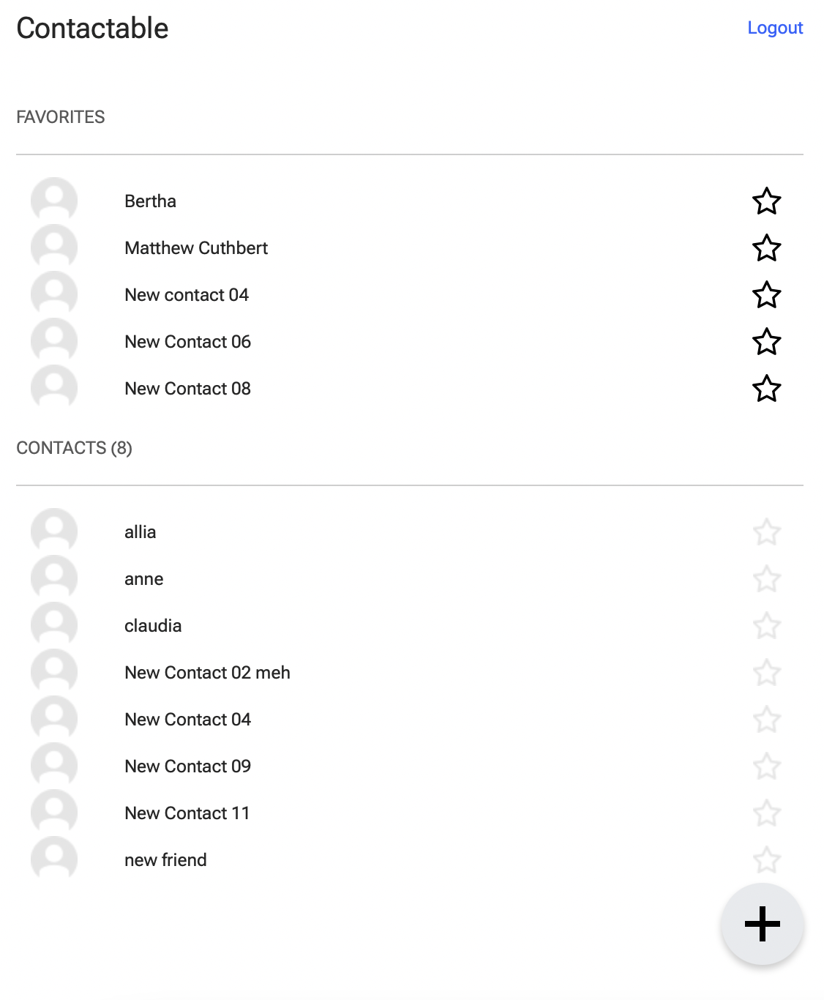
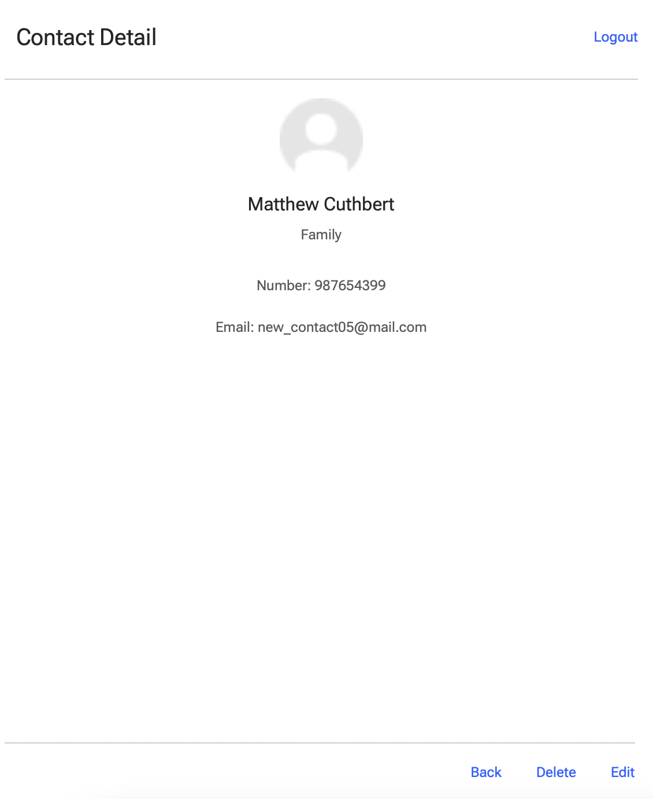
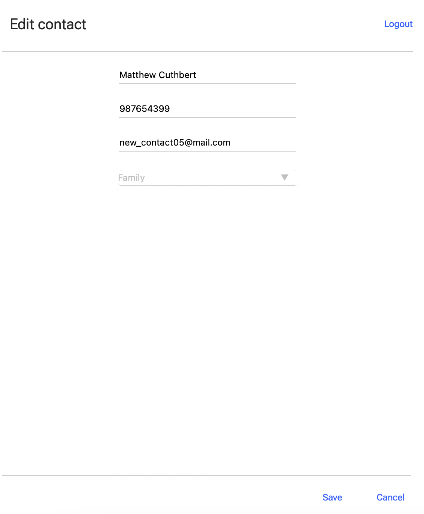
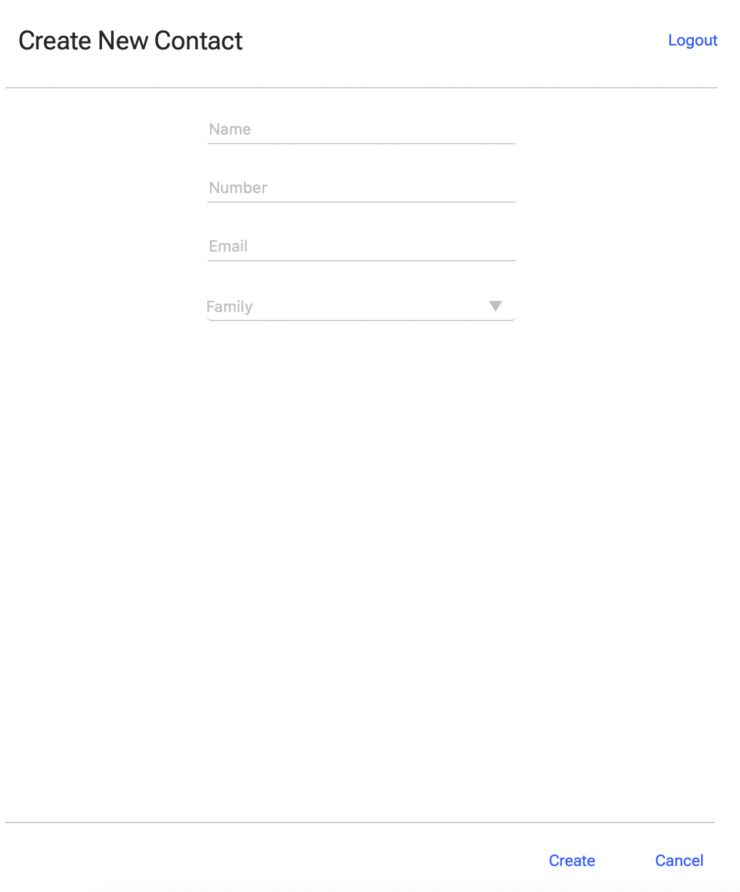

# Contactable

**Contactable** is a vanilla JS API client, developed as part of a project from [Codeable's](https://github.com/codeableorg) web-development bootcamp 💻.

## Screenshots

<table>
  <tr>
    <td></td>
    <td></td>
  </tr>
  <tr>
    <td></td>
    <td></td>
  </tr>
 </table>

## Authors:

- 👽 [lheredias](https://github.com/lheredias) (Javascript)
- 👽 [Diego12996](https://github.com/Diego12996) (CSS)

## Description

Keeping track of contact emails and phone numbers in your local memory (your brain) is something from the past. `Contactable` makes your life easier by keeping track of all that information for you.

## Resources

- [API url](https://contactable-api.herokuapp.com)
- [Insomnia Collection](./insomnia-collection.json)

## Features

- User can sign up, login and logout.
- Token is stored in session storage. 
- User can create, edit and delete a contact.
- User can add and remove a contact from a a favorite list.

## Complexity

- Makes use of JS modules and DOM injection.